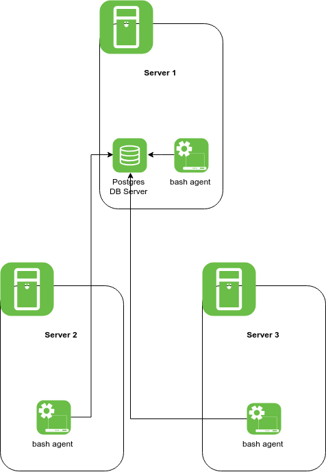

## Introduction
What does this project do? Cluster Monitor Agent is an internal tool 
that monitors the cluster resources.. it helps the infrastructure team to..

## Architecture and Design
1) Cluster digram with three Linux hosts, a DB, and agents:

2) The first table consists of general information on system resources including the memory and cpu architecture. The second table consists of the dynamic status of the cpu, memory, and disk resources.

3) The `host_info` script retrieves information on the memory and cpu architecture, and records the data into the database. The `host_usage` script retrieves the current status on the memory, cpu, and the disk, and records the data into the database.

## Usage
1) how to init database and tables
2) `host_info.sh` usage
3) `host_usage.sh` usage
4) `crontab` setup

## Improvements
Write at least 3 things you want to improve
e.g.
1) handle hardware update
...

